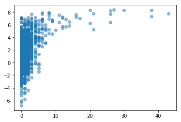
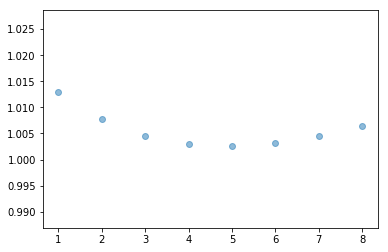
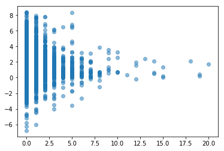
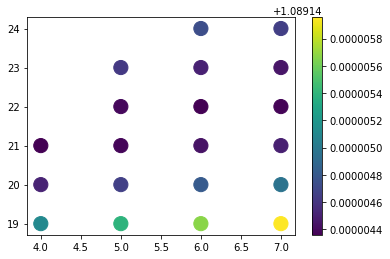
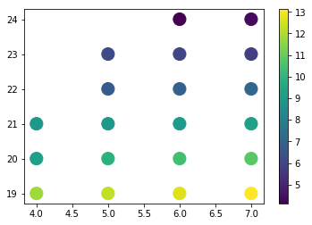

```python
import json
import nltk
import re
import itertools
from time import sleep
import sys
import numpy
import scipy
import time
from nltk.corpus import stopwords
from nltk.tokenize import RegexpTokenizer
from collections import Counter
with open("proj1_data.json") as fp:
    data = json.load(fp)
```


```python
train = data[:10000]
validation = data[10000:11000]
test = data[11000:12000]
```

# COMP 551 Project 1
Yuxiang Ma, Pengnan Fan, and Siyun Liao

## Part 1: Feature Extraction


```python
def countAllFrequencyNaive(dataSet): 
    totalString = str()
    for d in dataSet: 
        totalString = totalString + ' ' + d['text']
    countNaive = Counter([s for s in totalString.lower().strip().split()])
    totalCount = []
    return list(map(lambda v: v[0], countNaive.most_common(160)))
```


```python
def countAllFrequencyStopWord(dataSet): 
    
    totalString = str()
    
    for d in dataSet: 
        totalString = totalString + ' ' + d['text']
        
    tokenizer = RegexpTokenizer(r'\w+')
    withoutPunc = tokenizer.tokenize(totalString)
    
    stopwordsSet = set(stopwords.words())
    
    countDict = Counter(s.lower() for s in withoutPunc if s.lower() not in stopwordsSet)
    
    return list(map(lambda v: v[0], countDict.most_common(160)))
```


```python
# word count, no removal of punctuations
# @Param: singleText: text to process, numberOfFeatures: 0, 60, 160?
# @Return: vector of count (x in description)
def wordCountNaive(singleText, numberOfFeatures, totalCount): 
    
    countNaive = Counter([s.lower() for s in singleText.split()])
    returnVector = []
    for word in totalCount[:numberOfFeatures]: 
        returnVector.append(float(countNaive[word]))
    return returnVector


# word count, remove punc and stopwords to imporve model
# @Param: singleText: text to process, numberOfFeatures: 0, 60, 160?
# @Return: vector of count (x in description)
def wordCountWithStopwords(singleText, numberOfFeatures, totalCount): 
    
    tokenizer = RegexpTokenizer(r'\w+')
    withoutPunc = tokenizer.tokenize(singleText)
    
    stopwordsSet = set(stopwords.words())
    
    countDict = Counter([s.lower() for s in withoutPunc if s.lower() not in stopwordsSet])
    
    returnVector = []
    for word in totalCount[:numberOfFeatures]: 
        returnVector.append(float(countDict[word]))
    
    return returnVector
```


```python
def pythonListTranspose(xl): 
    return list(map(list, itertools.zip_longest(*xl)))
```


```python
# Feature Parser
# @Param: dataVector: sliced original dataset, wordCountFunction: <str> -> ndarray<float>, 
# wordPOSFunction: str -> list<float>, numberOfTextFeature: 0 to shut down Text Processing (Text Features)
# featureType: 
# @Return: tuple<ndarray, list>: xEngineered, yExtracted: rows: vector<samplePoint>, samplePoint[0->2]: basic Features, 
# samplePoint[3->162]: text, samplePoint[163->167]: extra
def parseFeatures(dataVector, wordCountFunction, numberOfTextFeatures, featureType): 
    y = []
    childrenFeature = []
    controversialityFeature = []
    isRootFeature = []
    processedTextFeature = []
    verbFeature = []
    nounFeature = []
    adjFeature = []
    urlFeature = []
    childAndControv = []
    childAndisRoot = []
    allInteracted = []
    controvAndisRoot = []
    identityFeature = []
    countFeature = []
    c = 0
    lenV = len(dataVector)
    for dataPoint in dataVector: 
        
        # Basic Features
        y.append(float(dataPoint['popularity_score']))
        if 'children' in featureType: 
            childrenFeature.append(float(dataPoint['children']))
        if 'controv' in featureType: 
            controversialityFeature.append(float(dataPoint['controversiality']))
        identityFeature.append(1.0)
        isRootVar = -1.0
        if 'isRoot' in featureType: 
            if dataPoint['is_root'] == True: 
                isRootVar = 1.0
                isRootFeature.append(isRootVar)
            else: 
                isRootVar = 0.0
                isRootFeature.append(isRootVar)
        
        # Text Features: 0 to shut down text feature
        if numberOfTextFeatures > 0 and 'text' in featureType: 
            processedTextFeature.append(wordCountFunction(dataPoint['text'], numberOfTextFeatures))
        
        # Extra Features
        if 'noun' in featureType or 'verb' in featureType or 'adj' in featureType: 
            wordAnalysis = wordPOSCountWithStopwords(dataPoint['text'])
        if 'verb' in featureType: 
            verbFeature.append(wordAnalysis[0])
        if 'noun' in featureType: 
            nounFeature.append(wordAnalysis[1])
        if 'adj' in featureType: 
            adjFeature.append(wordAnalysis[2])
        if 'url' in featureType: 
            urlFeature.append(hasURL(dataPoint['text']))
        if 'count' in featureType: 
            countFeature.append(float(len(dataPoint['text'].split())))
            
        # Interaction Effect: 
        if 'child and controv' in featureType: 
            childAndControv.append(float(dataPoint['children']) * float(dataPoint['controversiality']))
        if 'child and isRoot' in featureType: 
            childAndisRoot.append(float(dataPoint['children']) * isRootVar)
        if 'all interacted' in featureType: 
            allInteracted.append(float(dataPoint['children']) * isRootVar  * float(dataPoint['controversiality']))
        if 'controv and isRoot' in featureType: 
            controvAndisRoot.append(isRootVar  * float(dataPoint['controversiality']))
        
        # Process Bar
        sys.stdout.write('\r')
        count = int((float(c) / float(lenV)) * 100)
        sys.stdout.write("[%-20s] %d%%" % ('='*int(count / 5), count))
        sleep(0.001)
        sys.stdout.flush()
        c = c + 1
    if len(processedTextFeature) > 0: 
        processedTextFeature = pythonListTranspose(processedTextFeature)
    returnTotal = [childrenFeature, controversialityFeature, isRootFeature, verbFeature, nounFeature, adjFeature, urlFeature, countFeature, childAndControv, childAndisRoot, allInteracted, controvAndisRoot, identityFeature] + processedTextFeature
    return pythonListTranspose([x for x in returnTotal if len(x) > 0]), pythonListTranspose([y])
```


```python
def parseTransformedFeatures(dataVector, wordCountFunction, numberOfTextFeatures, featureType, **kwargs): 
    y = []
    childrenFeature = []
    childrenFeatureO = []
    controversialityFeature = []
    isRootFeature = []
    processedTextFeatureO = []
    processedTextFeature = []
    verbFeature = []
    nounFeature = []
    adjFeature = []
    urlFeature = []
    childAndControv = []
    childAndisRoot = []
    allInteracted = []
    controvAndisRoot = []
    identityFeature = []
    countFeature = []
    c = 0
    lenV = len(dataVector)
    childrenRate = 0.04
    if len(kwargs) > 0: 
        childrenRate = float(kwargs['crate'])
    for dataPoint in dataVector: 
        
        # Basic Features
        y.append(float(dataPoint['popularity_score']))
        if 'children' in featureType: 
            childrenFeatureO.append(float(dataPoint['children']))
        if 'childrenT' in featureType: 
            childrenFeature.append(1.0 - numpy.exp(-1 * childrenRate * float(dataPoint['children'])))
        if 'controv' in featureType: 
            controversialityFeature.append(float(dataPoint['controversiality']))
        identityFeature.append(1.0)
        isRootVar = -1.0
        if 'isRoot' in featureType: 
            if dataPoint['is_root'] == True: 
                isRootVar = 1.0
                isRootFeature.append(isRootVar)
            else: 
                isRootVar = 0.0
                isRootFeature.append(isRootVar)
        
        # Text Features: 0 to shut down text feature
        if numberOfTextFeatures > 0 and 'text' in featureType: 
            arr = wordCountFunction(dataPoint['text'], numberOfTextFeatures)
            processedTextFeatureO.append([a for a in arr])
        if numberOfTextFeatures > 0 and 'textT' in featureType: 
            arr = wordCountFunction(dataPoint['text'], numberOfTextFeatures)
            processedTextFeature.append([numpy.exp(-0.04 * (a)) * 1 for a in arr]) # numpy.cos(3 * a)
            
        # Extra Features
        if 'noun' in featureType or 'verb' in featureType or 'adj' in featureType: 
            wordAnalysis = wordPOSCountWithStopwords(dataPoint['text'])
        if 'verb' in featureType: 
            verbFeature.append(wordAnalysis[0])
        if 'noun' in featureType: 
            nounFeature.append(wordAnalysis[1])
        if 'adj' in featureType: 
            adjFeature.append(wordAnalysis[2])
        if 'url' in featureType: 
            urlFeature.append(hasURL(dataPoint['text']))
        if 'count' in featureType: 
            countFeature.append(float(len(dataPoint['text'].split())))
            
        # Interaction Effect: 
        if 'child and controv' in featureType: 
            childAndControv.append(float(dataPoint['children']) * float(dataPoint['controversiality']))
        if 'child and isRoot' in featureType: 
            childAndisRoot.append(float(dataPoint['children']) * isRootVar)
        if 'all interacted' in featureType: 
            allInteracted.append(float(dataPoint['children']) * isRootVar * float(dataPoint['controversiality']))
        if 'controv and isRoot' in featureType: 
            controvAndisRoot.append(isRootVar  * float(dataPoint['controversiality']))
        
        # Process Bar
        sys.stdout.write('\r')
        count = int((float(c) / float(lenV)) * 100)
        sys.stdout.write("[%-20s] %d%%" % ('='*int(count / 5), count))
        sleep(0.001)
        sys.stdout.flush()
        c = c + 1
    
    if len(processedTextFeature) > 0: 
        processedTextFeature = pythonListTranspose(processedTextFeature)
        processedTextFeatureO = pythonListTranspose(processedTextFeatureO)
        
    returnTotal = [childrenFeatureO, childrenFeature, controversialityFeature, isRootFeature, verbFeature, nounFeature, adjFeature, urlFeature, childAndControv, childAndisRoot, allInteracted, controvAndisRoot, countFeature, identityFeature] + processedTextFeature + processedTextFeatureO
    return pythonListTranspose([x for x in returnTotal if len(x) > 0]), pythonListTranspose([y])
```

## Part 2: Regression Algorithms


```python
def meanSquareError(valX, valY, w): 
    diffenence = numpy.power(numpy.transpose(numpy.subtract(valY, numpy.matmul(valX, w)))[0], 2)
    return numpy.divide(numpy.sum(diffenence), len(valY))
```


```python
def closedFormLinearRegression(x, y): 
    xT = numpy.transpose(numpy.array(x))
    return numpy.matmul(numpy.matmul(scipy.linalg.inv(numpy.matmul(xT, numpy.array(x))), xT), numpy.array(y))
```


```python
def gradientDescentLinearRegression(learnRateFunction, x, y, tol): 
    i = 1
    weight = numpy.array([[0.0] for l in range(len(x[0]))])
    weightN = numpy.array([[0.0] for l in range(len(x[0]))])
    xT = numpy.transpose(x)
    xTx = numpy.matmul(xT, x)
    xTy = numpy.matmul(xT, y)
    while True: 
        weight = weightN
        weightN = numpy.subtract(weight, 2 * learnRateFunction(i) * numpy.subtract(numpy.matmul(xTx, weight), xTy))
        i = i + 1
        if numpy.linalg.norm(numpy.subtract(weightN, weight), 2) <= tol: 
            break
    return weightN
```

## Part 3: Closed Form and Gradient Descent


```python
trainFeatures = parseFeatures(train, lambda u, v: wordCountNaive(u, v, tFreq), 0, ['children', 'controv', 'isRoot'])
validationFeatures = parseFeatures(validation, lambda u, v: wordCountNaive(u, v, vFreq), 0, ['children', 'controv', 'isRoot'])
```

    [=================== ] 99%


```python
startClosed = time.time()
resultClosed = closedFormLinearRegression(trainFeatures[0], trainFeatures[1])
endClosed = time.time()
errorClosed = meanSquareError(validationFeatures[0], validationFeatures[1], resultClosed)
errorTrained = meanSquareError(trainFeatures[0], trainFeatures[1], resultClosed)
print('result of closed form: \n', resultClosed)
print('error of closed form validation: \n', errorClosed)
print('error of closed form training: \n', errorTrained)
print('runtime of closed from: \n', endClosed - startClosed)
```

    result of closed form: 
     [[ 0.37536403]
     [-1.08584747]
     [-0.22627679]
     [ 0.82092517]]
    error of closed form validation: 
     1.0203266848431447
    error of closed form training: 
     1.0846830709157251
    runtime of closed from: 
     0.2911391258239746


```python
startGD = time.time()
resultGradient = gradientDescentLinearRegression(lambda v: float(0.0021 / (float(v) + 5.0)), trainFeatures[0], trainFeatures[1], 0.00000005)
endGD = time.time()
errorGradient = meanSquareError(validationFeatures[0], validationFeatures[1], resultGradient)
errorGradientT = meanSquareError(trainFeatures[0], trainFeatures[1], resultGradient)
print('result of gradient descent: \n', resultGradient)
print('error of gradient descent validation: \n', errorGradient)
print('error of gradient descent training: \n', errorGradientT)
print('runtime of gradient descent: \n', endGD - startGD)
```

    result of gradient descent: 
     [[ 0.37523338]
     [-1.03582869]
     [-0.22593438]
     [ 0.82024057]]
    error of gradient descent validation: 
     1.020554271304714
    error of gradient descent training: 
     1.0847119423381544
    runtime of gradient descent: 
     15.871299028396606


conclusion: closed form gives less error and less time

## Part 3: 60 and 160 text features


```python
tFreq = countAllFrequencyNaive(train)
trainFeatures60 = parseFeatures(train, lambda u, v: wordCountNaive(u, v, tFreq), 60, ['children', 'controv', 'isRoot', 'text'])
trainFeatures160 = parseFeatures(train, lambda u, v: wordCountNaive(u, v, tFreq), 160, ['children', 'controv', 'isRoot', 'text'])
```

    [=================== ] 99%


```python
vFreq = countAllFrequencyNaive(validation)
validationFeatures60 = parseFeatures(validation, lambda u, v: wordCountNaive(u, v, tFreq), 60, ['children', 'controv', 'isRoot', 'text'])
validationFeatures160 = parseFeatures(validation, lambda u, v: wordCountNaive(u, v, tFreq), 160, ['children', 'controv', 'isRoot', 'text'])
```

    [=================== ] 99%


```python
resultClosed60 = closedFormLinearRegression(trainFeatures60[0], trainFeatures60[1])
errorClosed60 = meanSquareError(validationFeatures60[0], validationFeatures60[1], resultClosed60)
errorTrained60 = meanSquareError(trainFeatures60[0], trainFeatures60[1], resultClosed60)
# print('result of closed form: \n', resultClosed60)
print('error of closed form validation: \n', errorClosed60)
print('error of closed form trained: \n', errorTrained60)
```

    error of closed form validation: 
     0.9839397297217665
    error of closed form trained: 
     1.060429141685383


```python
resultClosed160 = closedFormLinearRegression(trainFeatures160[0], trainFeatures160[1])
errorClosed160 = meanSquareError(validationFeatures160[0], validationFeatures160[1], resultClosed160)
errorTrained160 = meanSquareError(trainFeatures160[0], trainFeatures160[1], resultClosed160)
# print('result of closed form: \n', resultClosed160)
print('error of closed form validation: \n', errorClosed160)
print('error of closed form trained: \n', errorTrained160)
```

    error of closed form validation: 
     0.9950693970669264
    error of closed form trained: 
     1.0477763217987115


conclusion: 60 features are better than 160, validation error larger than closed form in 160: potentially overfitting

## Part 3: [Improvement 1] Transform of 'Children' feature

### Rational of Using Exponential Family function


```python
import matplotlib.pyplot as plt
plt.scatter(pythonListTranspose(trainFeatures60[0])[0], trainFeatures60[1], alpha=0.5)
```


    <matplotlib.collections.PathCollection at 0x1a295961d0>





```python
trainFeaturesI = parseTransformedFeatures(train, lambda u, v: wordCountNaive(u, v, tFreq), 0, ['childrenT', 'controv', 'isRoot'], crate = 0.05)
validationFeaturesI = parseTransformedFeatures(validation, lambda u, v: wordCountNaive(u, v, tFreq), 0, ['childrenT', 'controv', 'isRoot'], crate = 0.05) 
```

    [=================== ] 99%


```python
resultClosedI = closedFormLinearRegression(trainFeaturesI[0], trainFeaturesI[1])
errorClosedI = meanSquareError(validationFeaturesI[0], validationFeaturesI[1], resultClosedI)
errorTrainedI = meanSquareError(trainFeaturesI[0], trainFeaturesI[1], resultClosedI)
# print('result of closed form: \n', resultClosedI)
print('error of closed form validation: \n', errorClosedI)
print('error of closed form trained: \n', errorTrainedI)
```

    error of closed form validation: 
     1.0026119509501283
    error of closed form trained: 
     1.0420924933643285


```python
for i in range(1, 9): 
    trainFeaturesIS = parseTransformedFeatures(train, lambda u, v: wordCountNaive(u, v, tFreq), 0, ['childrenT', 'controv', 'isRoot'], crate = 0.01 * i)
    validationFeaturesIS = parseTransformedFeatures(validation, lambda u, v: wordCountNaive(u, v, tFreq), 0, ['childrenT', 'controv', 'isRoot'], crate = 0.01 * i)
    resultClosedIS = closedFormLinearRegression(trainFeaturesIS[0], trainFeaturesIS[1])
    errorClosedIS = meanSquareError(validationFeaturesIS[0], validationFeaturesIS[1], resultClosedIS)
    errorTrainedIS = meanSquareError(trainFeaturesIS[0], trainFeaturesIS[1], resultClosedIS)
    print('error of closed form validation: \n', errorClosedIS)
```

    [=================== ] 99%error of closed form validation: 
     1.0129101346219587
    [=================== ] 99%error of closed form validation: 
     1.0077902984505014
    [=================== ] 99%error of closed form validation: 
     1.0045997232409118
    [=================== ] 99%error of closed form validation: 
     1.0029820618160374
    [=================== ] 99%error of closed form validation: 
     1.0026119509501283
    [=================== ] 99%error of closed form validation: 
     1.0032061112221493
    [=================== ] 99%error of closed form validation: 
     1.0045276338655735
    [=================== ] 99%error of closed form validation: 
     1.0063850260001554


### Reason of Hyperparameter (-0.05)


```python
plt.scatter([i for i in range(1, 9)], [1.012910134621959, 1.0077902984505012, 1.0045997232409118, 1.0029820618160374, 1.0026119509501283, 1.003206111222149, 1.0045276338655733, 1.0063850260001557], alpha=0.5)
```


    <matplotlib.collections.PathCollection at 0x1a2b59c208>





## Part 3: [Improvement 2] Transform of 'text' feature

### Rational of Using Exponential Family function


```python
plt.scatter(pythonListTranspose(trainFeatures60[0])[6], trainFeatures[1], alpha=0.5)
```


    <matplotlib.collections.PathCollection at 0x1a2b83bef0>





```python
tFreq = countAllFrequencyNaive(data)
trainFeaturesI60 = parseTransformedFeatures(train, lambda u, v: wordCountNaive(u, v, tFreq), 60, ['children', 'controv', 'isRoot', 'textT'])
validationFeaturesI60 = parseTransformedFeatures(validation, lambda u, v: wordCountNaive(u, v, tFreq), 60, ['children', 'controv', 'isRoot', 'textT']) 
```

    [=================== ] 99%


```python
resultClosedI60 = closedFormLinearRegression(trainFeaturesI60[0], trainFeaturesI60[1])
errorClosedI60 = meanSquareError(validationFeaturesI60[0], validationFeaturesI60[1], resultClosedI60)
errorTrainedI60 = meanSquareError(trainFeaturesI60[0], trainFeaturesI60[1], resultClosedI60)
# print('result of closed form: \n', resultClosedI60)
print('error of closed form validation: \n', errorClosedI60)
print('error of closed form trained: \n', errorTrainedI60)
```

    error of closed form validation: 
     0.970215126374883
    error of closed form trained: 
     1.058597084267706


Conclusion: use of g(x) = exp(-0.04 * (x)) to transform all text features decreases loss from 0.9839397297217665 down to 0.970215126374883 on validation set (0.013724603346883413 improvement)

## Part 3: [Improvement 3] Interaction Between isRoot and children


```python
tFreq = countAllFrequencyNaive(data)
trainFeaturesIC60 = parseTransformedFeatures(train, lambda u, v: wordCountNaive(u, v, tFreq), 0, ['children', 'controv', 'isRoot', 'child and isRoot'])
validationFeaturesIC60 = parseTransformedFeatures(validation, lambda u, v: wordCountNaive(u, v, tFreq), 0, ['children', 'controv', 'isRoot', 'child and isRoot']) 
```

    [=================== ] 99%


```python
resultClosedIC60 = closedFormLinearRegression(trainFeaturesIC60[0], trainFeaturesIC60[1])
errorClosedIC60 = meanSquareError(validationFeaturesIC60[0], validationFeaturesIC60[1], resultClosedIC60)
errorTrainedIC60 = meanSquareError(trainFeaturesIC60[0], trainFeaturesIC60[1], resultClosedIC60)
# print('result of closed form: \n', resultClosedIC60)
print('error of closed form validation: \n', errorClosedIC60)
print('error of closed form trained: \n', errorTrainedIC60)
```

    error of closed form validation: 
     1.0202361543483793
    error of closed form trained: 
     1.084682948753223


Conclusion: a small improvement...

## Extra experiment: Justify of hyperparameter in GD, with Cross Validation


```python
import multiprocessing as mp

def nTest(B): 
    jointBN = []
    a = 25
    if B == 5: 
        a = 24
    elif B == 4: 
        a = 22
    for N in range(19, a): 
        cvs = [(trainFeatures[0][:2000], trainFeatures[1][:2000]), (trainFeatures[0][2000:4000], trainFeatures[1][2000:4000]), (trainFeatures[0][4000:6000], trainFeatures[1][4000:6000]), (trainFeatures[0][6000:8000], trainFeatures[1][6000:8000]), (trainFeatures[0][8000:10000], trainFeatures[1][8000:10000])]
        totalCV = 0
        totalTime = 0
        for l in range(5): 
            newTest = cvs[:l] + cvs[l + 1:]
            x = []
            y = []
            for t in newTest: 
                x = x + t[0]
                y = y + t[1]
            leavedOut = cvs[l]
            startGDE = time.time()
            resultGradientICV = gradientDescentLinearRegression(lambda v: float(N * 0.0001 / ((float(v) + B) + 1.0)), x, y, 0.00000005)
            endGDE = time.time()
            errorGradientICV = meanSquareError(leavedOut[0], leavedOut[1], resultGradientICV)
            totalCV = totalCV + errorGradientICV
            totalTime = totalTime + (endGDE - startGDE)
        jointBN.append([B, N, totalCV / 5, totalTime / 5])
        print('error of gradient descent validation:' + str(totalCV / 5) + ', value of N: ' + str(N) + ', value of B: ' + str(B) + ', time: ' + str(totalTime / 5))
    return jointBN

pool = mp.Pool()
res = pool.map(nTest, range(4, 8))
```

    error of gradient descent validation:1.0891451098588902, value of N: 19, value of B: 4, time: 11.81729474067688
    error of gradient descent validation:1.0891453903655914, value of N: 19, value of B: 5, time: 12.269378089904786
    error of gradient descent validation:1.0891456734387652, value of N: 19, value of B: 6, time: 12.65963397026062
    error of gradient descent validation:1.0891459559907308, value of N: 19, value of B: 7, time: 13.117210817337035
    error of gradient descent validation:1.0891445160973707, value of N: 20, value of B: 4, time: 9.171604204177857
    error of gradient descent validation:1.0891446630370496, value of N: 20, value of B: 5, time: 9.870405960083009
    error of gradient descent validation:1.0891448124136525, value of N: 20, value of B: 6, time: 10.383885765075684
    error of gradient descent validation:1.0891449687550439, value of N: 20, value of B: 7, time: 10.776163101196289
    error of gradient descent validation:1.0891443605364464, value of N: 21, value of B: 4, time: 8.898995923995972
    error of gradient descent validation:1.0891443807961891, value of N: 21, value of B: 5, time: 8.880037355422974
    error of gradient descent validation:1.0891444372148567, value of N: 21, value of B: 6, time: 9.015987491607666
    error of gradient descent validation:1.0891445038511514, value of N: 21, value of B: 7, time: 9.235931158065796
    error of gradient descent validation:1.0891443929027087, value of N: 22, value of B: 5, time: 6.629828786849975
    error of gradient descent validation:1.0891443662839209, value of N: 22, value of B: 6, time: 6.881188201904297
    error of gradient descent validation:1.089144373743705, value of N: 22, value of B: 7, time: 7.09939751625061
    error of gradient descent validation:1.0891446238798714, value of N: 23, value of B: 5, time: 6.099575567245483
    error of gradient descent validation:1.0891445076651096, value of N: 23, value of B: 6, time: 6.003013372421265
    error of gradient descent validation:1.0891444498344334, value of N: 23, value of B: 7, time: 5.806609964370727
    error of gradient descent validation:1.0891447359684867, value of N: 24, value of B: 6, time: 4.127821397781372
    error of gradient descent validation:1.0891446537909208, value of N: 24, value of B: 7, time: 4.396508407592774


```python
jointList = []
for r in res: 
    jointList = jointList + r
min(jointList, key = lambda u: u[2])
```


    [4, 21, 1.0891443605364464, 8.898995923995972]


### Joint distribution of Cross Validation Score (MSE) between beta0 and N0


```python
import matplotlib.pyplot as plt
fig, ax = plt.subplots()
scat = ax.scatter([l[0] for l in jointList], [l[1] for l in jointList], c=[l[2] for l in jointList], s=200, marker='o')
fig.colorbar(scat)
plt.show()
```





### Joint distribution of Cross Validated Runtime between beta0 and N0 (in seconds)


```python
fig, ax = plt.subplots()
scat = ax.scatter([l[0] for l in jointList], [l[1] for l in jointList], c=[l[3] for l in jointList], s=200, marker='o')
fig.colorbar(scat)
plt.show()
```





* Note: some of the points were left blank because it is too long to finish computing them

## Extra experiment: count word frequencies and eliminate stopwords


```python
tFreqS = countAllFrequencyStopWord(train)
trainFeatures60S = parseFeatures(data[:10000], lambda u, v: wordCountWithStopwords(u, v, tFreqS), 60, ['children', 'controv', 'isRoot', 'text'])
trainFeatures160S = parseFeatures(data[:10000], lambda u, v: wordCountWithStopwords(u, v, tFreqS), 160, ['children', 'controv', 'isRoot', 'text'])
```

    [=================== ] 99%


```python
validationFeatures60S = parseFeatures(validation, lambda u, v: wordCountWithStopwords(u, v, tFreqS), 60, ['children', 'controv', 'isRoot', 'text'])
validationFeatures160S = parseFeatures(validation, lambda u, v: wordCountWithStopwords(u, v, tFreqS), 160, ['children', 'controv', 'isRoot', 'text'])
```

    [=================== ] 99%


```python
resultClosed60S = closedFormLinearRegression(trainFeatures60S[0], trainFeatures60S[1])
errorClosed60S = meanSquareError(validationFeatures60S[0], validationFeatures60S[1], resultClosed60S)
errorTrained60S = meanSquareError(trainFeatures60S[0], trainFeatures60S[1], resultClosed60S)
# print('result of closed form: \n', resultClosed60S)
print('error of closed form validation: \n', errorClosed60S)
print('error of closed form trained: \n', errorTrained60S)
```

    error of closed form validation: 
     1.0160834359569333
    error of closed form trained: 
     1.0690435344142226


```python
resultClosed160S = closedFormLinearRegression(trainFeatures160S[0], trainFeatures160S[1])
errorClosed160S = meanSquareError(validationFeatures160S[0], validationFeatures160S[1], resultClosed160S)
errorTrained160S = meanSquareError(trainFeatures160S[0], trainFeatures160S[1], resultClosed160S)
# print('result of closed form: \n', resultClosed160S)
print('error of closed form validation: \n', errorClosed160S)
print('error of closed form trained: \n', errorTrained160S)
```

    error of closed form validation: 
     1.0377809673400562
    error of closed form trained: 
     1.0504238189332942


conclusion: eliminating stopwords does not gives better result

## Experimenting with potential new features: fraction of noun and existence of URL


```python
# word pos count, remove punc and stopwords to imporve model
# @Param: singleText: text to process
# @Return: vector of [verbcount, nouncount, adjcount]
def wordPOSCountWithStopwords(singleText): 
    
    tokenizer = RegexpTokenizer(r'\w+')
    withoutPunc = tokenizer.tokenize(singleText)
    setOfStop = set(stopwords.words())
    tagged = nltk.pos_tag([s.lower() for s in withoutPunc if s.lower() not in setOfStop])
    
    verbTotal, nounTotal, adjTotal = 0, 0, 0
    counts = Counter(tag for wordType, tag in tagged)
    totalCount = len(singleText.split())
    
    for key, value in counts.items(): 
        if 'NN' in key: 
            nounTotal = nounTotal + 1
        elif 'VB' in key: 
            verbTotal = verbTotal + 1
        elif 'JJ' in key: 
            adjTotal = adjTotal + 1
            
    if totalCount > 0: 
        return [float(verbTotal) / totalCount, float(nounTotal) / totalCount, float(adjTotal) / totalCount]
    else: 
        return [0.0, 0.0, 0.0]
# Test: 
# print(wordPOSCountWithStopwords(data[3]['text']))
# print(data[3]['text'])


def hasURL(text): 
    if re.match(r"(http://[^ ]+)", text) != None: 
        return 1.0
    else: 
        return 0.0
```

### With fraction of noun in whole words


```python
trainMyFeatures60 = parseFeatures(train, lambda u, v: wordCountNaive(u, v, tFreq), 0, ['children', 'controv', 'isRoot', 'noun'])
```

    [=================== ] 99%


```python
validationMyFeatures60 = parseFeatures(validation, lambda u, v: wordCountNaive(u, v, tFreq), 0, ['children', 'controv', 'isRoot', 'noun'])
```

    [=================== ] 99%


```python
resultMyClosed = closedFormLinearRegression(trainMyFeatures60[0], trainMyFeatures60[1])
errorMyClosed = meanSquareError(validationMyFeatures60[0], validationMyFeatures60[1], resultMyClosed)
errorMyTrained = meanSquareError(trainMyFeatures60[0], trainMyFeatures60[1], resultMyClosed)
# print('result of closed form: \n', resultMyClosed)
print('error of closed form validation: \n', errorMyClosed)
print('error of closed form trained: \n', errorMyTrained)
```

    error of closed form validation: 
     1.0205294940039473
    error of closed form trained: 
     1.0846431658913824


### With URL


```python
trainMyFeaturesURL60 = parseFeatures(train, lambda u, v: wordCountNaive(u, v, tFreq), 0, ['children', 'controv', 'isRoot', 'url'])
validationMyFeaturesURL60 = parseFeatures(validation, lambda u, v: wordCountNaive(u, v, tFreq), 0, ['children', 'controv', 'isRoot', 'url'])
```

    [=================== ] 99%


```python
resultMyClosedURL = closedFormLinearRegression(trainMyFeaturesURL60[0], trainMyFeaturesURL60[1])
errorMyClosedURL = meanSquareError(validationMyFeaturesURL60[0], validationMyFeaturesURL60[1], resultMyClosedURL)
errorMyTrainedURL = meanSquareError(trainMyFeaturesURL60[0], trainMyFeaturesURL60[1], resultMyClosedURL)
# print('result of closed form: \n', resultMyClosedURL)
print('error of closed form validation: \n', errorMyClosedURL)
print('error of closed form trained: \n', errorMyTrainedURL)
```

    error of closed form validation: 
     1.0206699968316335
    error of closed form trained: 
     1.0846292895663272


### With Word Count


```python
trainMyFeaturesWC = parseFeatures(train, lambda u, v: wordCountNaive(u, v, tFreq), 0, ['children', 'controv', 'isRoot', 'count'])
validationMyFeaturesWC = parseFeatures(validation, lambda u, v: wordCountNaive(u, v, tFreq), 0, ['children', 'controv', 'isRoot', 'count'])
```

    [=================== ] 99%


```python
resultMyClosedWC = closedFormLinearRegression(trainMyFeaturesWC[0], trainMyFeaturesWC[1])
errorMyClosedWC = meanSquareError(validationMyFeaturesWC[0], validationMyFeaturesWC[1], resultMyClosedWC)
errorMyTrainedWC = meanSquareError(trainMyFeaturesWC[0], trainMyFeaturesWC[1], resultMyClosedWC)
# print('result of closed form: \n', resultMyClosedWC)
print('error of closed form validation: \n', errorMyClosedWC)
print('error of closed form trained: \n', errorMyTrainedWC)
```

    error of closed form validation: 
     1.0174970518644633
    error of closed form trained: 
     1.083555207585464


### With all


```python
trainMyFeaturesALL60 = parseFeatures(train, lambda u, v: wordCountNaive(u, v, tFreq), 60, ['children', 'controv', 'isRoot', 'noun', 'url', 'count'])
validationMyFeaturesALL60 = parseFeatures(validation, lambda u, v: wordCountNaive(u, v, tFreq), 60, ['children', 'controv', 'isRoot', 'noun', 'url', 'count'])
```

    [=================== ] 99%


```python
resultMyClosedALL = closedFormLinearRegression(trainMyFeaturesALL60[0], trainMyFeaturesALL60[1])
errorMyClosedALL = meanSquareError(validationMyFeaturesALL60[0], validationMyFeaturesALL60[1], resultMyClosedALL)
errorMyTrainedALL = meanSquareError(trainMyFeaturesALL60[0], trainMyFeaturesALL60[1], resultMyClosedALL)
# print('result of closed form: \n', resultMyClosedALL)
print('error of closed form validation: \n', errorMyClosedALL)
print('error of closed form trained: \n', errorMyTrainedALL)
```

    error of closed form validation: 
     1.0179530939768886
    error of closed form trained: 
     1.0832639812714187


conclusion: adding extra features does not help with accuracy

## Extra experiment: Forward Selection


```python
import pandas
tFreq = countAllFrequencyNaive(data)
trainMyFeatures60FS = parseTransformedFeatures(train, lambda u, v: wordCountNaive(u, v, tFreq), 160, ['children', 'childrenT', 'controv', 'isRoot', 'text', 'textT'], crate = 0.01 * 7) # , 'child and controv', 'text'
validationMyFeatures60FS = parseTransformedFeatures(validation, lambda u, v: wordCountNaive(u, v, tFreq), 160, ['children', 'childrenT', 'controv', 'isRoot', 'text', 'textT'], crate = 0.01 * 7)
testMyFeatures60FS = parseTransformedFeatures(test, lambda u, v: wordCountNaive(u, v, tFreq), 160, ['children', 'childrenT', 'controv', 'isRoot', 'text', 'textT'], crate = 0.01 * 7)
```

    [=================== ] 99%


```python
traindf = pandas.DataFrame(trainMyFeatures60FS[0])
validationdf = pandas.DataFrame(validationMyFeatures60FS[0])
traindf.shape, validationdf.shape
```


    ((10000, 325), (1000, 325))


```python
fullPredictors = set([i for i in range(0, 325)])
levelBest = [[sys.float_info.max, set()]]
c = 0

for k in range(1, len(fullPredictors)): 
    
    prevBest = levelBest[k - 1][1]
    currentPredictors = fullPredictors - prevBest
    mseVal = []
    
    for predictor in currentPredictors: 
        selected = prevBest | set([predictor])
        
        trainX = traindf[list(selected)].values
        validX = validationdf[list(selected)].values
        trainY = trainMyFeatures60[1]
        validY = validationMyFeatures60[1]
        
        try: 
            resultW = closedFormLinearRegression(trainX, trainY)
        except: 
            continue
        mseVal.append([meanSquareError(validX, validY, resultW), selected])
    
    currentBest = min(mseVal, key = lambda x: x[0])
    
    # Process Bar
    sys.stdout.write('\r')
    count = int((float(c) / float(len(fullPredictors))) * 100)
    sys.stdout.write("[%-20s] %d%%" % ('='*int(count / 5), count))
    if len(mseVal) > 0: 
        levelBest.append(currentBest)
        sys.stdout.write(str(currentBest))
    sleep(0.001)
    sys.stdout.flush()
    c = c + 1
    

trainX = traindf[list(fullPredictors)].values
validX = validationdf[list(fullPredictors)].values
trainY = trainMyFeatures60[1]
validY = validationMyFeatures60[1]
ok = True
try: 
    resultW = closedFormLinearRegression(trainX, trainY)
except: 
    ok = False
if ok: 
    levelBest.append([meanSquareError(validX, validY, resultW), selected])
```

    [=================== ] 99%[5.442394709712067, {0, 1, 2, 3, 4, 5, 6, 7, 8, 9, 10, 11, 12, 13, 14, 15, 16, 17, 18, 19, 20, 21, 22, 23, 24, 25, 26, 27, 28, 29, 30, 31, 32, 33, 34, 35, 36, 37, 38, 39, 40, 41, 42, 43, 44, 45, 46, 47, 48, 49, 50, 51, 52, 53, 54, 55, 56, 57, 58, 59, 60, 61, 62, 63, 64, 65, 66, 67, 68, 69, 70, 71, 72, 73, 74, 75, 76, 77, 78, 79, 80, 81, 82, 83, 84, 85, 86, 87, 88, 89, 90, 91, 92, 93, 94, 95, 96, 97, 98, 99, 100, 101, 102, 103, 104, 105, 106, 107, 108, 109, 110, 111, 112, 113, 114, 115, 116, 117, 118, 119, 120, 121, 122, 123, 124, 125, 126, 127, 128, 129, 130, 131, 132, 133, 134, 135, 136, 137, 138, 139, 140, 141, 142, 143, 144, 145, 146, 147, 148, 149, 150, 151, 152, 153, 154, 155, 156, 157, 158, 159, 160, 161, 162, 163, 164, 165, 166, 167, 168, 169, 170, 171, 172, 173, 174, 175, 176, 177, 178, 179, 180, 181, 182, 183, 184, 185, 186, 187, 188, 189, 190, 191, 192, 193, 194, 195, 196, 197, 198, 199, 200, 201, 202, 203, 204, 205, 206, 207, 208, 209, 210, 211, 212, 214, 215, 216, 217, 218, 219, 220, 221, 222, 223, 224, 225, 226, 227, 228, 229, 230, 231, 232, 233, 234, 235, 236, 237, 238, 239, 240, 241, 242, 243, 244, 245, 246, 247, 248, 249, 250, 251, 252, 253, 254, 255, 256, 257, 258, 259, 260, 261, 262, 263, 264, 265, 266, 267, 268, 269, 270, 271, 272, 273, 274, 275, 276, 277, 278, 279, 280, 281, 282, 283, 284, 285, 286, 287, 288, 289, 290, 291, 292, 293, 294, 295, 296, 297, 298, 299, 300, 301, 302, 303, 304, 305, 306, 307, 308, 309, 310, 311, 312, 313, 314, 315, 316, 317, 318, 319, 320, 321, 322, 323, 324}]


```python
bestOfAll = min(levelBest, key = lambda v: v[0])
```

### Validation Performance


```python
print('best set of predictors with interaction term: \n', bestOfAll[1])
print('error: \n', bestOfAll[0])
print('0-5: childrenTransformed, controv, isRoot, identity')
print('6-165: transformed text')
print('166-325: original text')
```

    best set of predictors with interaction term: 
     {256, 1, 2, 3, 260, 258, 6, 263, 8, 9, 10, 266, 12, 261, 14, 7, 257, 17, 18, 269, 276, 277, 22, 279, 280, 23, 5, 285, 287, 32, 290, 291, 292, 37, 294, 295, 298, 46, 305, 307, 308, 53, 309, 318, 319, 322, 324, 268, 270, 87, 165, 171, 175, 179, 184, 185, 186, 187, 189, 193, 194, 195, 196, 199, 202, 203, 204, 205, 207, 209, 210, 212, 217, 219, 220, 221, 224, 227, 230, 231, 234, 235, 236, 238, 241, 242, 245, 250, 251, 253}
    error: 
     0.9200926839324391
    0-5: childrenTransformed, controv, isRoot, identity
    6-165: transformed text
    166-325: original text


## Final Performance

### Test Performance


```python
resultClosedFinal = closedFormLinearRegression(numpy.array(trainMyFeatures60FS[0])[:,list(bestOfAll[1])], trainMyFeatures60FS[1])
meanSquareError(numpy.array(testMyFeatures60FS[0])[:,list(bestOfAll[1])], testMyFeatures60FS[1], resultClosedFinal)
```


    1.2736897834505778


### Training Performance


```python
resultClosedFinal = closedFormLinearRegression(numpy.array(trainMyFeatures60FS[0])[:,list(bestOfAll[1])], trainMyFeatures60FS[1])
meanSquareError(numpy.array(trainMyFeatures60FS[0])[:,list(bestOfAll[1])], trainMyFeatures60FS[1], resultClosedFinal)
```


    1.0154527650222982


Conclusion: overfits validation set (meta-overfitting)

### Saving Most frequency words


```python
tFreq = countAllFrequencyNaive(train)
```


```python
f = open("words.txt", "w")
f.write(str(tFreq)[2:len(str(tFreq)) - 1])
```


    1280


